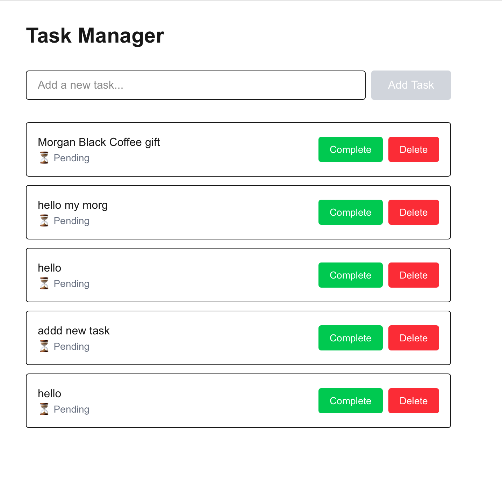

# Task Manager

A full-stack task management application built with Next.js 15, Supabase, and TypeScript. Features real-time CRUD operations with a clean, responsive interface.

## 🚀 Live Demo

**[View Live Application](https://task-manager-kappa-mocha.vercel.app/)**

## ✨ Features

- ✅ Create, read, update, and delete tasks
- ✅ Real-time database synchronization
- ✅ Responsive design - works on desktop and mobile
- ✅ Clean, modern UI with Tailwind CSS
- ✅ Type-safe with TypeScript
- ✅ Server-side rendering for optimal performance

## 🛠️ Tech Stack

- **Frontend:** Next.js 15 (App Router), React, TypeScript
- **Styling:** Tailwind CSS
- **Database:** Supabase (PostgreSQL)
- **Deployment:** Vercel
- **Package Manager:** pnpm

## 📸 Screenshots


*Simple and intuitive task management interface*

## 🏃 Running Locally

### Prerequisites

- Node.js 18+ installed
- pnpm installed (`npm install -g pnpm`)
- Supabase account (free tier)

### Setup Instructions

1. **Clone the repository**
```bash
git clone https://github.com/emileEmileEmile/task-manager.git
cd task-manager
```

2. **Install dependencies**
```bash
pnpm install
```

3. **Set up Supabase**

Create a new project at [supabase.com](https://supabase.com) and run this SQL in the SQL Editor:

```sql
create table tasks (
  id uuid default gen_random_uuid() primary key,
  title text not null,
  completed boolean default false,
  created_at timestamp with time zone default timezone('utc'::text, now()) not null
);
```

4. **Configure environment variables**

Copy `.env.example` to `.env.local`:
```bash
cp .env.example .env.local
```

Add your Supabase credentials to `.env.local`:
```env
NEXT_PUBLIC_SUPABASE_URL=your_supabase_project_url
NEXT_PUBLIC_SUPABASE_ANON_KEY=your_supabase_anon_key
```

You can find these in your Supabase project settings under **API**.

5. **Run the development server**
```bash
pnpm dev
```

Open [http://localhost:3000](http://localhost:3000) to view the app.

## 📁 Project Structure

```
task-manager/
├── app/
│   ├── components/
│   │   ├── AddTaskForm.tsx    # Form for creating new tasks
│   │   └── TaskItem.tsx        # Individual task component
│   ├── page.tsx                # Main page with task list
│   ├── layout.tsx              # Root layout
│   └── globals.css             # Global styles
├── lib/
│   └── supabase.ts             # Supabase client configuration
├── .env.local                  # Environment variables (not in repo)
└── package.json
```

## 🎯 What I Learned

Building this project taught me:

- **Next.js App Router:** Server components, dynamic rendering, and the modern Next.js paradigm
- **Supabase Integration:** Real-time PostgreSQL database with a simple JavaScript client
- **Deployment:** Vercel deployment pipeline with environment variable management
- **TypeScript:** Type-safe React components and API calls
- **Dynamic Rendering:** Solving static generation issues for real-time data (`export const dynamic = 'force-dynamic'`)

## 🔮 Future Improvements

- [ ] Add user authentication (Supabase Auth)
- [ ] Implement task categories/tags
- [ ] Add due dates and priority levels
- [ ] Dark mode toggle
- [ ] Task search and filtering
- [ ] Drag-and-drop task reordering

## 🐛 Known Issues

None currently! The app works reliably on all modern browsers and devices.

## 📝 License

MIT License - feel free to use this project for learning or as a template for your own apps.

## 🤝 Contributing

This is a learning project, but suggestions and improvements are welcome! Feel free to open an issue or submit a pull request.

---

**Built by Emile** | [GitHub](https://github.com/emileEmileEmile) | Learning Full-Stack Development (2024-2025)